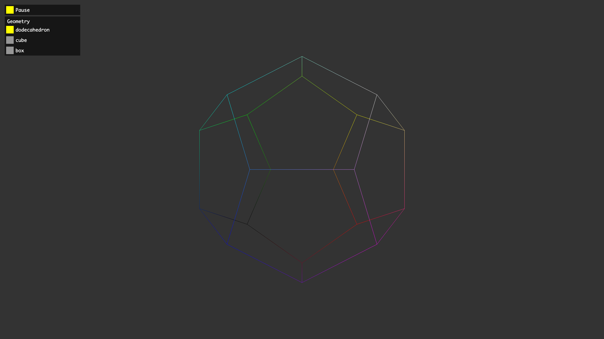

# geom-edges

Computes unique edges for a list of faces.



## Installation

```bash
npm install geom-edges
```

## Usage

```js
import computeEdges from "geom-edges";

const faces = [[0, 1, 2, 3], [3, 2, 5, 4], ...];
const edges = computeEdges(faces); // [[0, 1], [1, 2], ...]
```

## API

#### `computeEdges(faces): edges`

**Parameters**

- faces: `TypedArray | Array | Array<[x, y, z]>` – list of face indices `new Array([a, b, c, d], [a, b, c, d], ...)`

_Note: if faces is a TypedArray (eg. `new Uint32Array([a, b, c, a, b, c, ...]`) or a flat array of positions (eg. `new Array(a, b, c, a, b, c, ...)`), we assumes faces are triangles._

**Returns**

- edges: `TypedArray | Array<[x, y, z]>` – list of edges (`new Uint32Array([a, b, b, c, c, d, ...]` or `new Array([a, b], [b, c], [c, d], ...)`)

## License

MIT. See [license file](https://github.com/vorg/geom-edges/blob/master/LICENSE.md).
